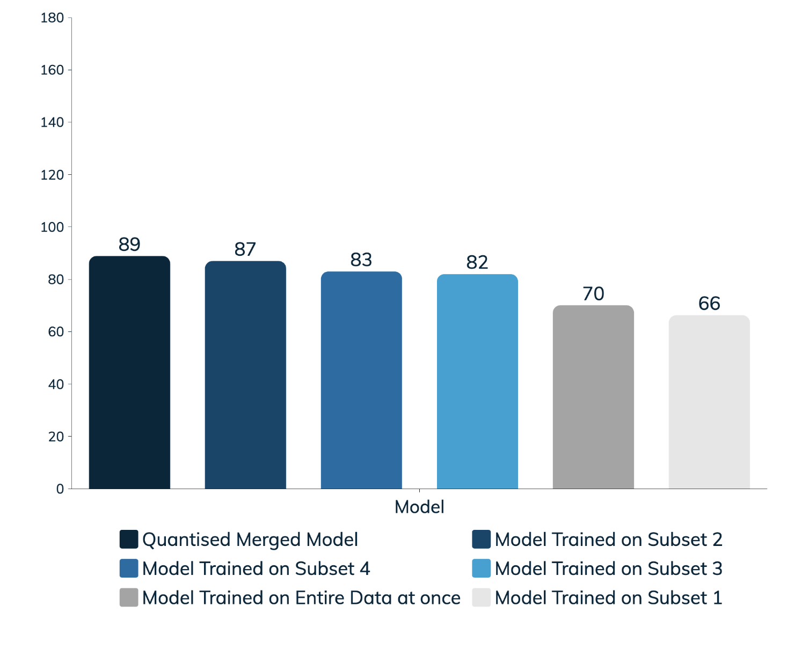

# 🚀 Implementation of Distributed Computing with Model Quantization for Pneumonia Image Detection
This project implements distributed computing and model quantization for pneumonia image detection. A dataset is split into four subsets, each training a separate Xception model. The models are merged using weighted averaging, prioritizing those with higher accuracy. The final ensemble is quantized to optimize performance for resource-limited environments, with the AUC ROC curve used to address any accuracy loss from quantization.

## 📁 Project Structure
```
Project Root
│
├── .DS_Store                      # System file created by macOS (not project-related)
├── .gitignore                     # Specifies files/directories for Git to ignore
├── LICENSE                        # MIT License 
├── README.md                      # Overview and setup instructions for the project
│
├── appy.py                        # Main Python script for app deployment or model inference
├── class_labels.txt               # Lists class labels ("Normal" and "Pneumonia")
├── data_split.ipynb               # Splits the dataset into different subsets
├── eval.png                       # Evaluation plot or image for model performance visualization
├── experiments.ipynb              # Contains experiment workflows for model tuning
├── merge_quantization.ipynb       # Merges the trained models and handles model quantization
├── merged_model.h5                # Merged model in HDF5 format (before quantization)
├── requirements.txt               # Python dependencies for the project
│
├── xception_build_on_entire_data.ipynb  # Trains an Xception model on the entire dataset
├── xception_build_train1.ipynb    # Trains an Xception model on the first data subset
├── xception_build_train2.ipynb    # Trains an Xception model on the second data subset
├── xception_build_train3.ipynb    # Trains an Xception model on the third data subset
└── xception_build_train4.ipynb    # Trains an Xception model on the fourth data subset
```

## ✨Key Features

1. **Distributed Training for Scalability**  
   The dataset is split into four subsets, enabling parallel training of Xception models. This leads to:
   - **Faster Training**: Parallelism reduces training time on large datasets.
   - **Scalability**: Easily scales to handle larger datasets without performance loss.

2. **Ensemble Learning via Weighted Averaging**  
   Models are combined through weighted averaging, prioritizing more accurate models:
   - **Improved Robustness**: Reduces the impact of individual model errors.
   - **Adaptability**: Adjusts dynamically to model strengths for a more reliable ensemble.

3. **Model Quantization for Efficiency**  
   The final ensemble is quantized to reduce size and resource usage:
   - **Optimized for Deployment**: Suitable for resource-constrained environments like mobile and edge devices.
   - **Lower Latency**: Smaller footprint and faster inference, ideal for real-time applications.

## 📈 Performance Benchmarks:
Below is a bar graph comparing the accuracy of individual Xception models, the final ensemble quantized model, showcasing the performance improvements achieved through distributed training and model optimization.
<div align = "center">
  
</div>


## ⭐ Highlighting Benefits:
1. **Accuracy Preservation:** The use of the AUC ROC curve helps maintain high accuracy even after quantization, ensuring the model remains effective in real-world settings.<br>
2. **Data Privacy Maintenance:** Ensures data privacy by training models on distributed sources and combining them, minimizing direct exposure of sensitive data while still benefiting from diverse data inputs.<br>
3. **Enhanced Model Robustness:** Merges the outputs of individual models based on their accuracy, ensuring that the final ensemble is robust and well-calibrated for detecting pneumonia.


## 🏗️ Xception Model Overview:

The Xception model, a deep convolutional neural network, excels in feature extraction for image classification:
<div align = "center">
  
</div>

## 📜 License

This project is licensed under the MIT License - see the [LICENSE](LICENSE) file for details.


